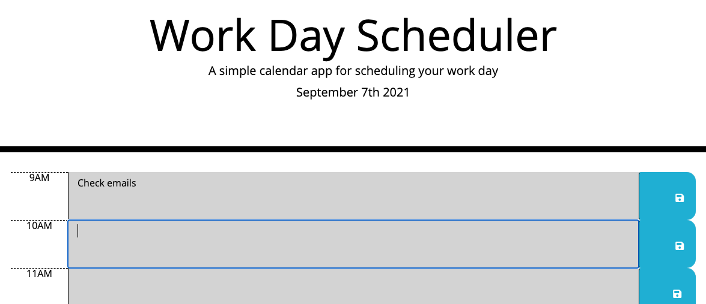
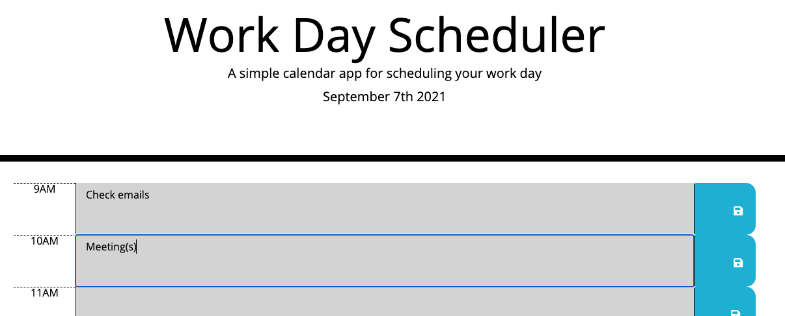
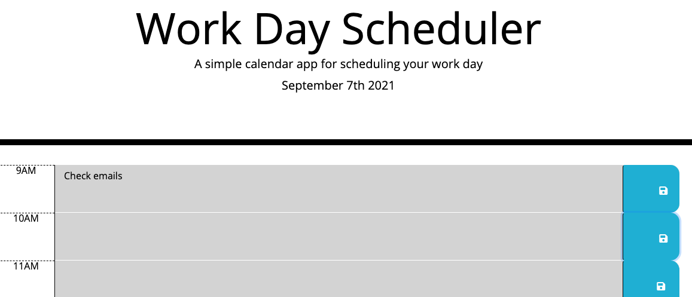

# Day Planner

This project's purpose was to help organize a busy schedule 📆 🗒️

## Table of Contents

- [Screenshots ](#Screenshots)
- [Features](#Features)
- [Repository Link](#Repository)
- [License] (#License)
- [Questions](#Questions)

## Screenshots

Notice below that the field accepts an input;

An input in the following 10 AM field below...

...is only saved if the button is clicked;

## Features

This site will assist in the scheduling of daily tasks with the assistance of local storage on the hard drive and a color coded look at the day ahead.

## Repository

- [Github](https://benwofford.github.io/day-planner/)

## License

MIT License

Copyright (c) 2021 Ben Wofford

Permission is hereby granted, free of charge, to any person obtaining a copy
of this software and associated documentation files (the "Software"), to deal
in the Software without restriction, including without limitation the rights
to use, copy, modify, merge, publish, distribute, sublicense, and/or sell
copies of the Software, and to permit persons to whom the Software is
furnished to do so, subject to the following conditions:

The above copyright notice and this permission notice shall be included in all
copies or substantial portions of the Software.

THE SOFTWARE IS PROVIDED "AS IS", WITHOUT WARRANTY OF ANY KIND, EXPRESS OR
IMPLIED, INCLUDING BUT NOT LIMITED TO THE WARRANTIES OF MERCHANTABILITY,
FITNESS FOR A PARTICULAR PURPOSE AND NONINFRINGEMENT. IN NO EVENT SHALL THE
AUTHORS OR COPYRIGHT HOLDERS BE LIABLE FOR ANY CLAIM, DAMAGES OR OTHER
LIABILITY, WHETHER IN AN ACTION OF CONTRACT, TORT OR OTHERWISE, ARISING FROM,
OUT OF OR IN CONNECTION WITH THE SOFTWARE OR THE USE OR OTHER DEALINGS IN THE
SOFTWARE.

## Questions

For any questions regarding this project, please reach out via email:

ben.wofford@hey.com
